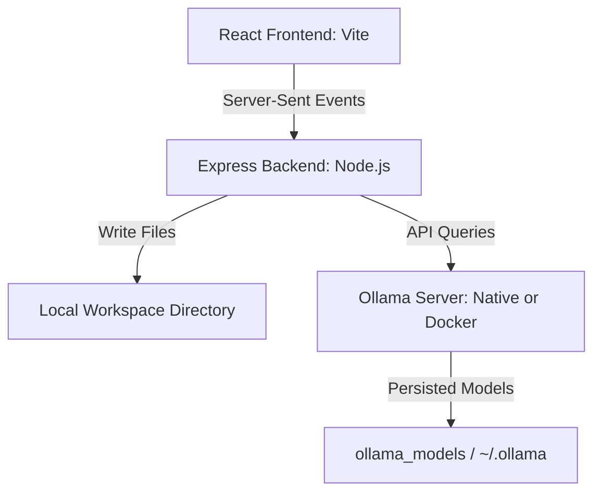

# DevAssist Engine: Local Project Generator ⚡

DevAssist is a local, lightweight web-based codebase generator. Built with a React frontend, Node.js backend, and Ollama, it allows you to input developer prompts and generate complete, production-ready project workspaces directly on your local filesystem.

The application is containerized and optimized specifically to run smoothly on lightweight machines, including an **8GB M1 MacBook Air**, without lag.

---

## Features

- 🛠 **Zero-Configuration Project Generation**: Write a prompt and get complete multi-file project structures generated automatically.
- ⚙️ **Dual-Mode Ollama Setup**: 
  - **GPU Accelerated (Recommended for M1 Mac)**: Auto-detects and connects to a native host Ollama instance for high-speed Metal-backed generation.
  - **Docker CPU Mode**: Automatically spins up an Ollama container in Docker Compose if no native instance is found.
- 📂 **Persistent Host-Mounted Workspace**: All generated codes appear immediately in your host machine's `./workspace` directory.
- 📦 **Dockerized Models Excluded**: Dockerizes services completely while keeping Ollama model weight directories mounted locally, saving image size and avoiding redundant redownloads.
- 💻 **Real-Time Terminal Console**: Follow each step of the planning and file generation via SSE (Server-Sent Events).
- 👁️ **File Tree Previewer**: A built-in code editor panel to preview generated files instantly.

---

## Architecture Diagram



---

## Prerequisites

Before starting, ensure you have:
1. **Docker & Docker Compose** installed.
2. (Recommended for M1/M2/M3 Macs) **Ollama** installed natively on macOS. Run `brew install ollama` or download it from [ollama.com](https://ollama.com/). Keep the Ollama application running.

---

## Getting Started

### 1. Launch the Application

In your terminal, navigate to the project directory and run the launcher script:

```bash
./run.sh
```

#### What `run.sh` does:
- It checks if a native Ollama instance is already running on your macOS host at `http://localhost:11434`.
- **If detected**: It configures the Docker container to link to it (`http://host.docker.internal:11434`) and boots only the React frontend and Node backend. This gives you **Metal GPU acceleration** and saves memory.
- **If not detected**: It spins up all three containers (Ollama, Backend, Frontend) via Docker Compose.

### 2. Stop the Application

To shut down all running services and clean up containers, run the shutdown script:

```bash
./stop.sh
```

---

## Usage Guide

1. **Access the Web Interface**:
   Open [http://localhost:5173](http://localhost:5173) in your web browser.

2. **Model Download (First Run)**:
   - If you don't have any models installed, the app will display a warning.
   - Click **"Pull qwen2.5-coder (1.5B)"** in the LLM Configuration panel on the left.
   - You can watch the real-time download progress bar. `qwen2.5-coder:1.5b` is highly recommended because it is compact, extremely fast, and specifically optimized for software development.
   - Alternatively, enter any other model name (like `llama3.2` or `llama3.2:3b`) and click **"Pull"**.

3. **Generate Projects**:
   - Write a detailed prompt in the top input box. Examples:
     - *"Create a complete node.js express app with basic authentication and database storage using a local json file."*
     - *"Build a python CLI application that acts as a markdown task tracker."*
   - Press Enter or click the Play button.
   - The **Log Terminal Console** will print live updates as the engine creates the file layout structure and iteratively writes the code.
   - Click files in the **Project File Explorer** on the left to preview their contents in the code editor window.

4. **Access the Source Code**:
   All generated projects are written directly to the target destination folder you provided.
   - If an absolute path was specified (e.g. `/Users/deepawasthi/Developer/MyNewProject`), it is written there. (Note: On macOS inside Docker, the container maps `/Users` on the host to `/Users` inside the container, allowing absolute paths in your user directory to work seamlessly).
   - If a relative path was specified (or left blank), the project is written inside the `./workspace` directory.
   
   You can open this folder directly in your IDE (like VS Code), run terminal commands, and commit it to git!

---

## System Configuration Details

- **Frontend Port**: `5173`
- **Backend Port**: `5001`
- **Ollama Port**: `11434`
- **Workspace Location**: `./workspace` (auto-created on host)
- **Persistent Models Volume**: `./ollama_models` (used if Ollama is run in Docker container)
